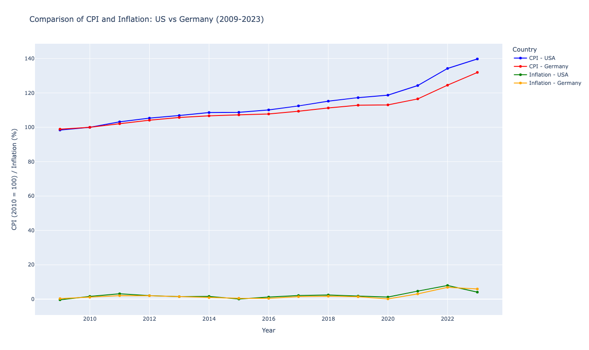

<!DOCTYPE html>
<html lang="en">
<head>
    <meta charset="UTF-8">
    <meta name="viewport" content="width=device-width, initial-scale=1.0">
    <title>Economic Data Visualizations</title>
</head>
<body>
    <h1>Economic Data Visualizations</h1>
    
    <h2>USA CPI Visualization</h2>
    

</body>
</html>

# **📊 Analyzing Inflation and Economic Trends**  
### *A Comparative Data Analysis of U.S. and German CPI, GDP, and Inflation Across Presidential and Chancellor Tenures*  
[**🔗 Colab Notebook**](https://colab.research.google.com/drive/1UML-Yw0N9hM8dGBtFqaZXXMvbUHIwwmK?usp=sharing)

---

## **🌟 Project Overview**
This project conducts a comparative analysis of **inflation** and **economic trends** in the **United States** and **Germany** from **2009 to 2023**, focusing on the impact of political leadership changes in each country.  

### Key Economic Indicators:
- **📈 Consumer Price Index (CPI)**  
- **💹 Inflation (Annual %)**  
- **💰 GDP (Current US$)**  
- **📊 GDP Deflator (2010 base year)**  

We examine these metrics under **U.S. presidencies** (Obama, Trump, Biden) and **German chancellorships** (Merkel, Scholz) to identify patterns and insights into leadership-driven economic changes.

---

## **❓ Research Questions**
1. **How do inflation trends (CPI and GDP deflator) differ across different political leadership tenures in the U.S. and Germany?**  
2. **How do changes in economic indicators like GDP reflect shifts in leadership policies and their economic impact?**  
3. **What are the similarities and differences in inflation trends between the U.S. and Germany during the studied political periods?**

---

## **📚 Data Sources**

- **Consumer Price Index (CPI):** Measures changes in the cost of a fixed basket of goods and services.  
- **Inflation (Annual %, CPI-based):** Tracks annual percentage changes in the cost of goods and services.  
- **Inflation (GDP Deflator):** Measures economy-wide inflation via price changes in all goods and services.  
- **GDP (Current US$):** Tracks the total economic output at current market prices.  
- **GDP Deflator (2010 = 100):** Measures economy-wide inflation relative to a 2010 base year.  

---

## **⚙️ Methodology**

- **Data Slicing:** Extracted data for 2009-2023 for the U.S. and Germany.  
- **Cleaning:** Handled missing or inconsistent data using interpolation.  
- **Indexing:** Reformatted datasets to enable easier analysis and visualization.  
- **Base-Year Normalization:** Addressed discrepancies in base years for GDP deflator metrics.

---

## **📊 Analysis and Visualization**

We analyzed the data across the political tenures:  
- **U.S. Presidencies:** Obama (2009-2017), Trump (2017-2021), Biden (2021-2023)  
- **German Chancellorships:** Merkel (2009-2021), Scholz (2021-2023)

### Key Steps:
- **Shaded Graphs:** Highlighted political terms to correlate economic trends with leadership changes.  
- **Multi-Metric Plots:** Combined CPI and inflation data for a holistic view.  
- **Cross-Country Comparisons:** Analyzed similarities and differences between the U.S. and Germany.

---

## **📈 Key Visualizations**
1. **CPI Trends:** Evolution of consumer price indices in both countries.  
2. **Inflation (Annual %, CPI):** Fluctuations in annual consumer inflation rates.  
3. **CPI vs. Inflation:** Correlation between CPI levels and inflation rates.  
4. **Inflation (GDP Deflator):** Broader economic inflation trends.  
5. **GDP (Current US$):** Economic growth trends in both nations.  
6. **GDP Deflator:** Price level changes relative to the 2010 base year.  
7. **Inflation Comparison (GDP Deflator vs CPI):** Contrasting inflation measures over time.

 









---

## **📊 Key Findings**

### **Inflation Trends**:
- The **U.S. CPI** showed greater volatility compared to Germany, influenced by economic policies and external shocks.  
- Germany exhibited **lower and steadier CPI-based inflation** compared to the U.S.  

### **GDP Deflator Trends**:
- The **U.S. GDP deflator** revealed more pronounced price shifts, reflecting broader economic dynamics.  
- Germany's GDP deflator remained relatively stable, indicative of consistent fiscal policies.  

### **Political Impact**:
- U.S. inflation rates varied significantly across presidencies, reflecting differing policies during recovery periods and crises (e.g., COVID-19).  
- Germany's inflation trends mirrored adjustments in fiscal strategies under Merkel and Scholz, especially during global economic events.  

---

## **⚠️ Limitations**

- **Data Scope:** Analysis focused on **2009-2023**, limiting insights into long-term trends.  
- **External Events:** Factors like the **COVID-19 pandemic** may have disproportionately influenced trends during specific periods.  
- **Comparison Challenges:** Discrepancies in GDP deflator metrics were normalized but required careful contextual interpretation.  

---
